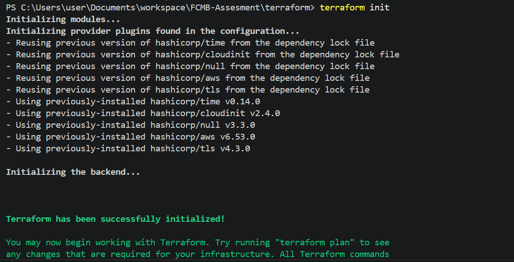
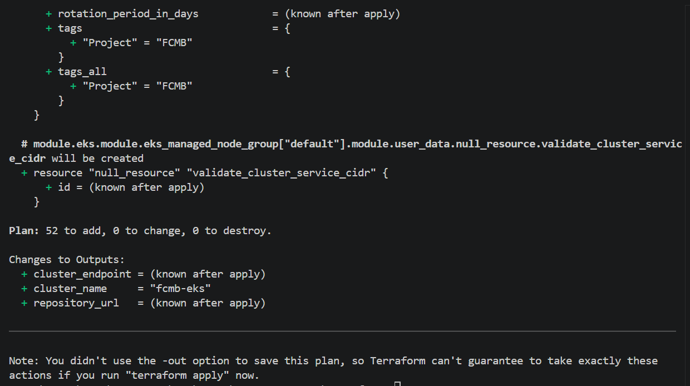
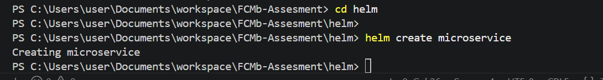
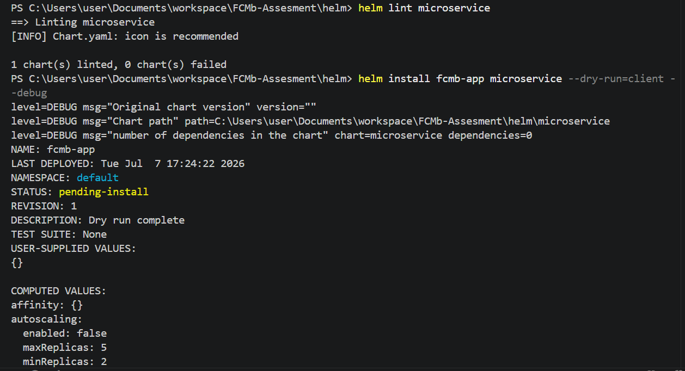
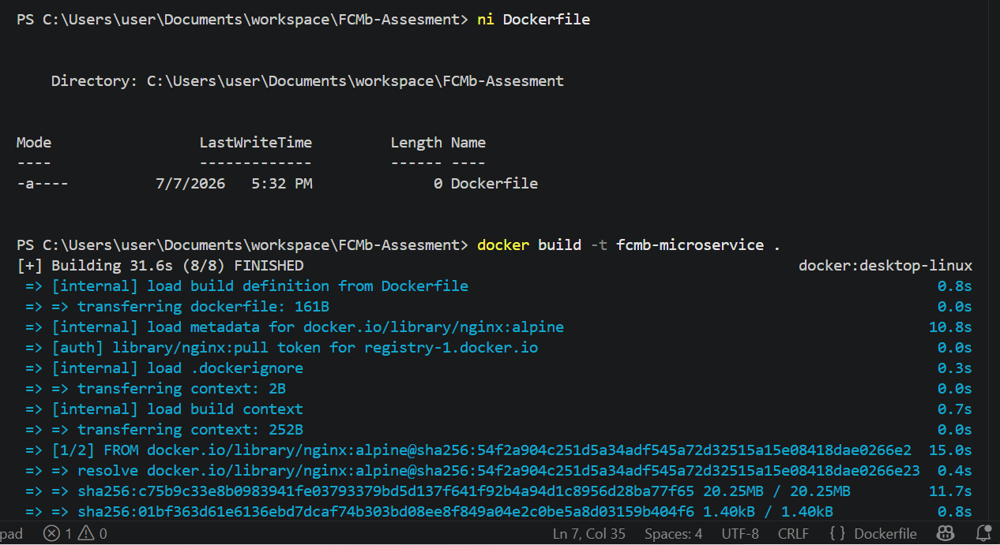
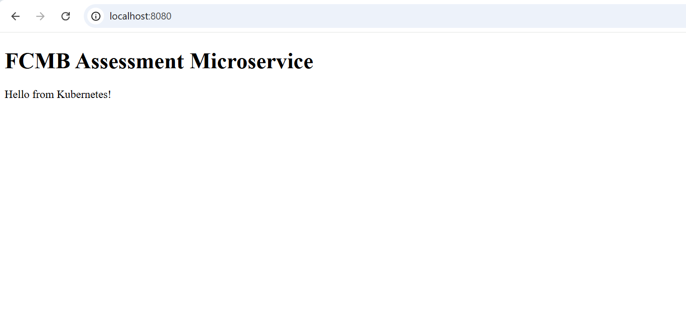
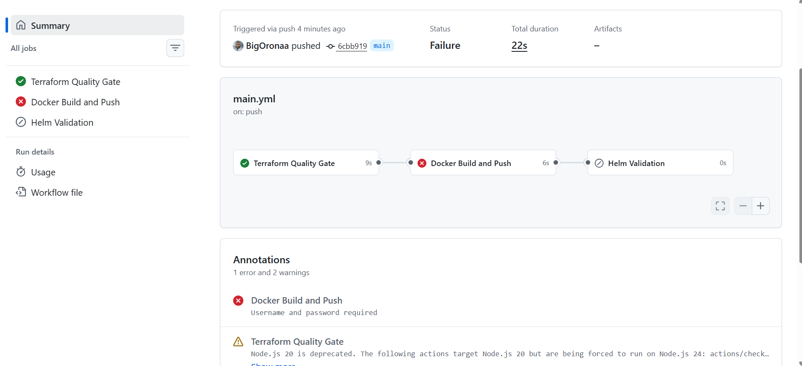
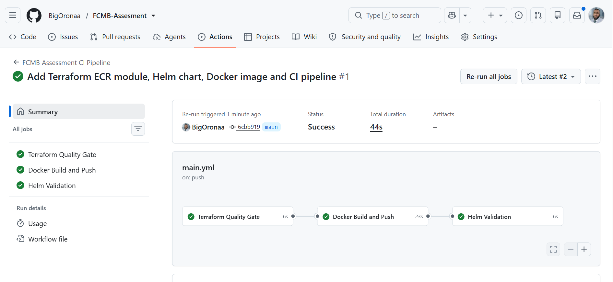

# FCMB Assessment – Terraform, Helm, Docker & GitHub Actions

## Overview
This repository implements a production-oriented Infrastructure as Code and CI pipeline solution for the FCMB DevOps assessment.

### Objectives Delivered
- Reusable Terraform module for Amazon ECR.
- Root Terraform configuration.
- Helm chart for a microservice.
- Configurable PodDisruptionBudget.
- Configurable ResourceQuota and container requests/limits.
- Dynamic image repository injection.
- Dockerized microservice.
- GitHub Actions CI pipeline performing validation, image build/push and Helm dry-run.

## Repository Structure
```text
.
├── .github/workflows/main.yml
├── terraform/
│   ├── modules/ecr
│   ├── main.tf
│   ├── variables.tf
│   └── outputs.tf
├── helm/microservice
├── app/
├── Dockerfile
└── README.md
```

## Architecture
Developer Commit
→ GitHub Actions
→ Terraform fmt / init / validate / plan
→ Docker Build
→ Docker Push (Docker Hub)
→ Helm Lint
→ Helm Dry Run (image.repository injected dynamically)

## Terraform
The Terraform configuration is modularized with a reusable ECR module. Validation includes:
- terraform fmt -check
- terraform init
- terraform validate
- terraform plan

The implementation follows reusable module principles to simplify future extension for EKS and additional AWS services.

### Images



## Helm
The Helm chart supports:
- Dynamic image repository
- Configurable resource requests/limits
- Optional ResourceQuota
- PodDisruptionBudget
- Configurable Ingress
- Dry-run validation

Validation:
```bash
helm lint helm/microservice
helm install fcmb-app helm/microservice --dry-run=client --debug
```
### Images




## Docker
The application is containerized using Docker and exposed through NGINX.

Validation:
```bash
docker build -t fcmb-microservice .
docker run -d -p 8080:80 fcmb-microservice
```

### Images


The app was working on the browser on port 8080:80

### Images


## GitHub Actions
Pipeline stages:
1. Terraform Quality Gate
2. Docker Build and Push
3. Helm Validation

## Engineering Issue Encountered

### Docker Hub Authentication Failure

Initial pipeline failure:

```text
Error: Username and password required
```
### Images


### Root Cause

The workflow expected repository secrets named:

- DOCKER_USERNAME
- DOCKER_PASSWORD

A repository secret had instead been created using the Docker username itself as the secret name, so the workflow received empty credentials.

### Resolution

Repository secrets were corrected to:

| Secret | Purpose |
|--------|---------|
| DOCKER_USERNAME | Docker Hub username |
| DOCKER_PASSWORD | Docker Hub Personal Access Token |

The workflow authenticated successfully using:

```yaml
uses: docker/login-action@v3
with:
  username: ${{ secrets.DOCKER_USERNAME }}
  password: ${{ secrets.DOCKER_PASSWORD }}
```

After correcting the secret names, the pipeline completed successfully.

### Images


## Pipeline Result

Successful execution of:
- Terraform Quality Gate
- Docker Build and Push
- Helm Validation

## Security Considerations
- Docker Hub Personal Access Token used instead of account password.
- Terraform state excluded from version control.
- Sensitive files ignored through .gitignore.
- Dynamic configuration managed through Helm values.

## Future Enhancements
- Remote Terraform backend using S3 and DynamoDB locking.
- GitHub OIDC authentication to AWS.
- ArgoCD GitOps deployment.
- Automated deployment to Amazon EKS.
